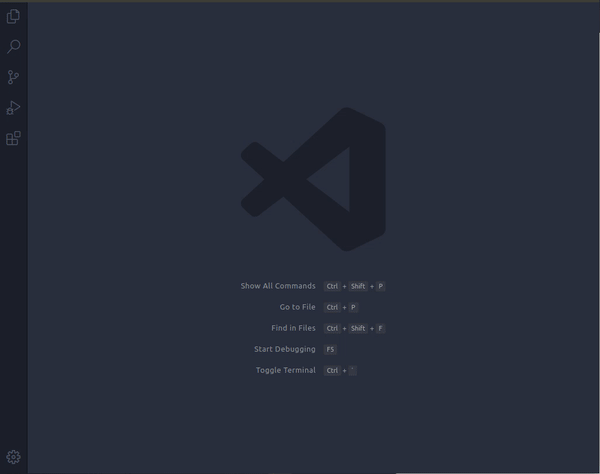

# vscode-shex-extensions
ShEx extensions for Visual Studio Code

## shex-languaje-extension
This extension provides highlighting and snippets for [ShEX](http://shex.io/) languaje

### Installation
Launch VS Code Quick Open (Ctrl+P), paste the following command, and press enter.
```
ext install PabloMenndez.shex
```
You can also find the extension in the extensions market simply by typing "shex"

### Usage
Once you have installed this extension you will be able to view it features in any .shex file. <br>
Since VSCode works with scopes, the file must first be saved with the .shex extension.


### Snippets
Currently, the only snippet available is for autocompleting the most common wikidata prefixes.


## yashe-extension
[YASHE](http://www.weso.es/YASHE/) is a [ShEx](http://shex.io/) editor which offers features as syntax highlighting ,error checking and autocompleters. This extension allows YASHE to be used within Visual Studio Code.

### Installation
Launch VS Code Quick Open (Ctrl+P), paste the following command, and press enter.
```
ext install PabloMenndez.yashe
```
You can also find the extension in the extensions market simply by typing shex

### Using yashe-extension
Once you have installed the extension, you can easily use YASHE with the following steps:
1. Open the Command Pallete(Ctrl+Shift+P)
2. Type ShEx or YASHE 
3. Execute the command called "ShEx: Start YASHE Editor"


