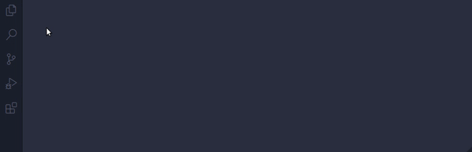

# shex-languaje-extension
This extension provides highlighting and snippets for [ShEX](http://shex.io/) languaje

## Installation
Launch VS Code Quick Open (Ctrl+P), paste the following command, and press enter.
```
ext install PabloMenndez.shex
```
You can also find the extension in the extensions market simply by typing "shex"

## Usage
Once you have installed this extension you will be able to view it features in any .shex file
Since VSCode works with scopes, the file must first be saved with the .shex extension.




### Snippets
Currently, the only snippet available is to autocomplete the most common wikidata prefixes.

